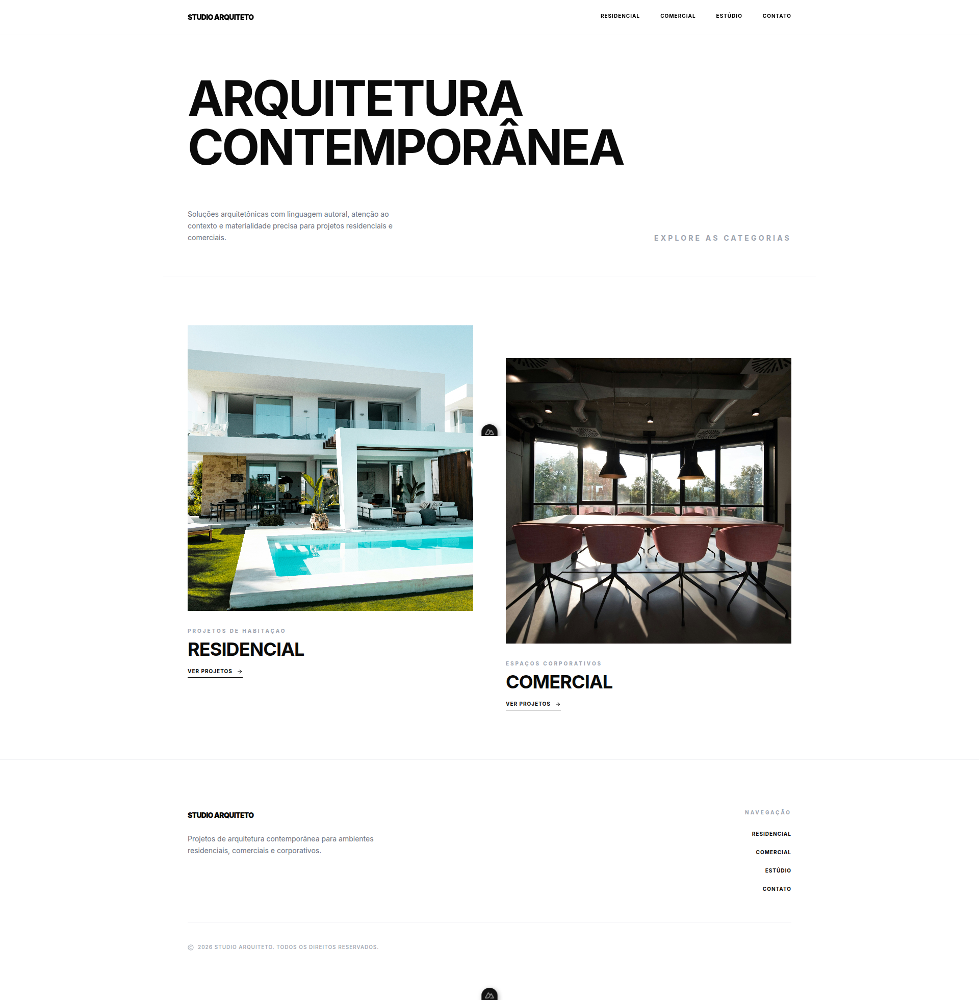

# Studio Arquiteto

Site portifolio de arquitetura desenvolvido com Nuxt, com foco em apresentar projetos das categorias residencial e comercial.



## Visao geral

- Home com destaque para categorias e navegacao para os projetos.
- Listagens por categoria (`/residencial` e `/comercial`).
- Pagina dinamica de projeto em `/projetos/[slug]`.
- Conteudo gerenciado em JSON via `@nuxt/content`, com validacao por schema (`zod`).

## Stack

- `Nuxt 4`
- `Vue 3`
- `@nuxt/content`
- `@nuxt/image`
- `@nuxt/icon`
- `Tailwind CSS`

## Requisitos

- Node.js 20+ (recomendado)
- npm (ou outro gerenciador compativel)

## Instalacao

```bash
npm install
```

## Desenvolvimento

Inicie o servidor local em `http://localhost:3000`:

```bash
npm run dev
```

## Build e preview

Gerar build de producao:

```bash
npm run build
```

Visualizar build localmente:

```bash
npm run preview
```

Gerar versao estatica:

```bash
npm run generate
```

## Estrutura de conteudo

As informacoes exibidas no site ficam na pasta `content/`.

- Categorias: `content/categories/*.json`
- Projetos: `content/projects/**/*.json`

As colecoes e schemas estao definidos em `content.config.ts`.

### Exemplo de projeto

```json
{
    "slug": "residencia-arcos",
    "title": "Residencia Arcos",
    "location": "Sao Paulo, SP",
    "year": "2025",
    "area": "320",
    "description": "Descricao do projeto...",
    "image": "/imagens/residencia-arcos/capa.jpg",
    "gallery": ["/imagens/residencia-arcos/01.jpg", "/imagens/residencia-arcos/02.jpg"],
    "category": "residencial"
}
```

## Scripts disponiveis

- `npm run dev`: ambiente de desenvolvimento
- `npm run build`: build de producao
- `npm run preview`: preview da build
- `npm run generate`: geracao estatica

## Observacoes

- O campo `slug` do projeto deve ser unico.
- O campo `category` deve ser `residencial` ou `comercial`.
- As imagens devem existir nos caminhos informados no JSON.
